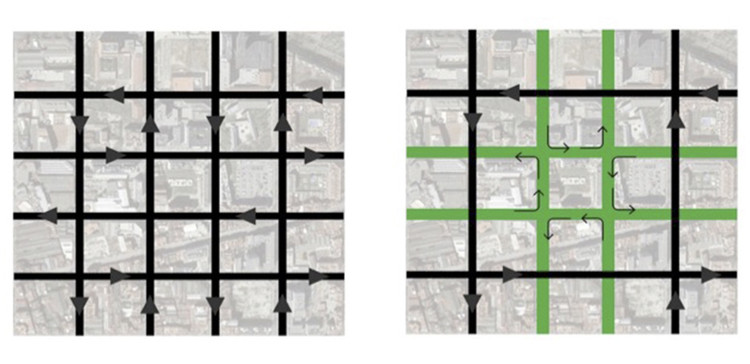

# **Simulación para el comportamiento de una Super Manzana**

## **Descripción:**

Nuestro sistema multiagentes simula un modelo de supermanzana en una zona central de una ciudad cualquiera. El sistema consta de dos “módulos” principales. El primero se encarga de ejecutar una simulación con agentes basados en automóviles. Después de realizar la simulación, recopila los datos de cada agente durante la simulación y los exporta en un formato apropiado para su lectura. La segunda parte se encarga de desplegar en un ambiente tridimensional los resultados de dichos cálculos de la simulación, desplegando automóviles en una escena de una ciudad y replicando los movimientos de cada uno de ellos. 

El primer módulo cuenta con tres tipos de agentes: Bicicleta, Carro y Camión. El agente de Carro y Camión comparten los mismos estados, aunque difieren un poco en las restricciones de las calles donde pueden transitar. Por otro lado, la bicicleta comparte la mayoría de los estados, pero, adicionalmente, puede dar vuelta a la derecha y solo puede viajar en las calles interiores. El modelo se encargará de generar múltiples agentes (de todos los tipos ya descritos) y los hará recorrer un modelo en forma de malla para observar el comportamiento que tienen al reaccionar a sus percepciones del ambiente.
Mientras se ejecuta la simulación, se guardan las posiciones de cada agente y, finalizando, se exportan. Esta información se lee por Unity y éste se encarga de instanciar la cantidad correcta de tipos de agentes y de moverlos apropiadamente en el espacio tridimensional.

## **Requisitos:**
A continuación se muestran las librerias y tecnologías necesarias para usar el proyecto:

- Python 3.7.11 o superior
- Agentpy
- Flask
- Seaborn
- Pandas
- IPython
- Anaconda
- Unity 2019.4.18f1

## **Instalación:**
Para la instalación recomendamos el uso de conda para los ambientes. Una vez instalado, realizar el siguiente comando en el directorio

    $ conda create --name Agentes --file requirements.txt

Es necesario instalar la version de Unity mostrada anteriormente y verificar que el paquete se pueda abrir correctamente 

## **Ejecución:**

Se debe de ejecutar el Jupyter Notebook, las celdas hasta el servidor de manera secuencial. Esto abrirá un socket en localhost

Para simular el escenario base:

    http://localhost:3000/simulate/

Esto regresa un JSON con un arreglo con los tipos de vehiculos, los cuales contienen un arreglo de cada step. Este step contiene un indice que representa cada agente. Cada indice es un arreglo, en donde cada indice representa algo distinto.

- 0: arreglo de posicion [x,y] 
- 1: orientacion

La orientacion viene dada de la siguiente manera: 
- 0 = up
- 1 = right
- 2 = down
- 3 = left

## **Documentación API:**
La API corre en Python 3, para esto es necesario contar con las librerias necesarias. El puerto usado es el 3000 y es recomendado usar https para las llamadas. 

**Página de documentación:** https://documenter.getpostman.com/view/15737721/UVJYLzEy

## **Live Demo**
Work in progress